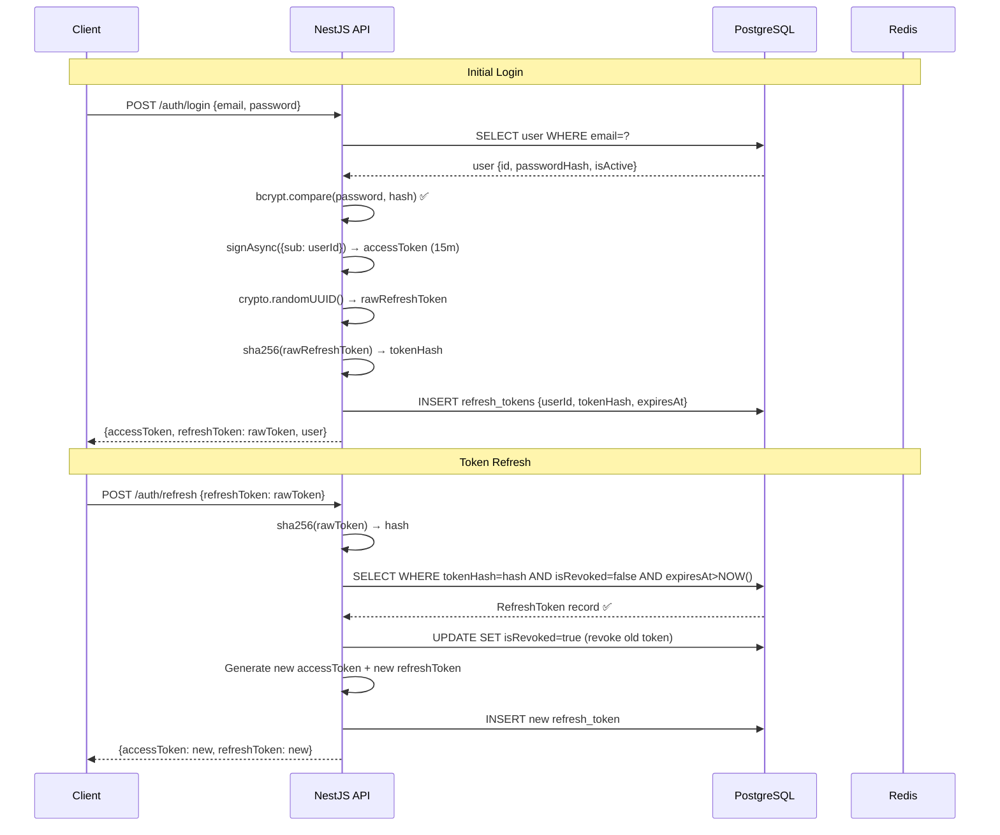

# System Architecture

## Overview

ProjectHub follows a **layered monolith** architecture designed to be microservice-ready. The entire application runs as a single NestJS process, but module boundaries are clean enough to extract individual services in the future without changing business logic.

---

## High-Level Architecture

```
┌─────────────────────────────────────────────────────────────────┐
│                         CLIENT LAYER                            │
│                                                                 │
│   ┌──────────────────────────────────────────────────────────┐  │
│   │  React + Vite SPA                                        │  │
│   │  ┌──────────────┐ ┌──────────────┐ ┌────────────────┐  │  │
│   │  │ Redux Toolkit│ │TanStack Query│ │  Socket.IO     │  │  │
│   │  │ (auth/ui/org)│ │(server state)│ │  Client        │  │  │
│   │  └──────────────┘ └──────────────┘ └────────────────┘  │  │
│   │  ┌──────────────────────────────────────────────────┐   │  │
│   │  │            IndexedDB (Offline Drafts)            │   │  │
│   │  └──────────────────────────────────────────────────┘   │  │
│   └──────────────────────────────────────────────────────────┘  │
└─────────────────────────────────────────────────────────────────┘
                              │ HTTPS + WSS
                              ▼
┌─────────────────────────────────────────────────────────────────┐
│                        NGINX (Reverse Proxy)                    │
│   • Rate limiting (100 req/min API, 10 req/min auth)           │
│   • SSL termination                                             │
│   • WebSocket upgrade headers                                   │
│   • Static file serving (frontend build)                       │
└─────────────────────────────────────────────────────────────────┘
                              │
                              ▼
┌─────────────────────────────────────────────────────────────────┐
│                      NESTJS APPLICATION                         │
│                                                                 │
│  Middleware Chain:                                              │
│  CorrelationId → Helmet → CORS → ThrottlerGuard               │
│       → JwtAuthGuard → RolesGuard → Controller                │
│                                                                 │
│  ┌──────────┐ ┌──────────┐ ┌──────────┐ ┌──────────────────┐ │
│  │   Auth   │ │ Projects │ │  Tasks   │ │  Organizations   │ │
│  │  Module  │ │  Module  │ │  Module  │ │     Module       │ │
│  └──────────┘ └──────────┘ └──────────┘ └──────────────────┘ │
│  ┌──────────┐ ┌──────────┐ ┌──────────┐ ┌──────────────────┐ │
│  │  Redis   │ │  Queue   │ │WebSocket │ │    Payments      │ │
│  │  Module  │ │  Module  │ │ Gateway  │ │     Module       │ │
│  └──────────┘ └──────────┘ └──────────┘ └──────────────────┘ │
└─────────────────────────────────────────────────────────────────┘
         │                    │                    │
         ▼                    ▼                    ▼
┌────────────────┐  ┌──────────────────┐  ┌──────────────────┐
│  PostgreSQL 16 │  │    Redis 7       │  │   BullMQ Jobs    │
│                │  │                  │  │ (on same Redis)  │
│  • users       │  │ • projects cache │  │                  │
│  • orgs        │  │ • presence hash  │  │ • notifications  │
│  • projects    │  │ • rate limiting  │  │ • audit logs     │
│  • tasks       │  │ • BullMQ queues  │  │ • task events    │
│  • audit_logs  │  │                  │  │                  │
└────────────────┘  └──────────────────┘  └──────────────────┘
```

---

## Request Lifecycle

A typical authenticated API request flows as follows:

```
1. Browser → POST /api/v1/organizations/org-id/projects
             Headers: Authorization: Bearer <token>
                      x-organization-id: org-uuid

2. Nginx → Rate limit check → Pass to NestJS

3. NestJS Pipeline:
   a. CorrelationIdMiddleware    → Attach x-correlation-id header
   b. LoggingInterceptor        → Log request (method, url, timing)
   c. JwtAuthGuard              → Verify token → Load user from DB
   d. RolesGuard                → Check memberships table → Validate role
   e. ValidationPipe            → Validate DTO (whitelist + transform)
   f. ProjectsController        → Call route handler
   g. ProjectsService           → Execute business logic
      → Redis get('projects:org-id')  → MISS
      → PostgreSQL query (organization_id = org-id)
      → Redis set('projects:org-id', data, 300s)
      → BullMQ.add('project-events', 'project-created', {...})
   h. TransformInterceptor      → Wrap as { success: true, data: {...} }

4. BullMQ (async, after response):
   → NotificationService.createForAllMembers(...)
   → AuditLog saved to PostgreSQL

5. Socket.IO (async):
   → server.to('org:org-id').emit('project_created', data)
   → Real-time update delivered to all connected org members
```

---

## Module Structure

### Backend Modules

```
modules/
├── auth/               # JWT authentication
│   ├── strategies/     # PassportJS strategies (jwt, local)
│   ├── guards/         # JwtAuthGuard, RolesGuard
│   ├── dto/            # LoginDto, RegisterDto, RefreshTokenDto
│   ├── auth.service.ts # register, login, refresh, logout
│   └── auth.module.ts  # Global module (JwtModule export)
│
├── users/              # User management
│   ├── dto/            # UpdateUserDto
│   ├── users.service.ts
│   └── users.controller.ts
│
├── organizations/      # Multi-tenancy
│   ├── dto/
│   ├── organizations.service.ts
│   └── organizations.controller.ts
│
├── memberships/        # RBAC roles
│   ├── dto/
│   ├── memberships.service.ts  # Last-admin protection
│   └── memberships.controller.ts
│
├── projects/           # Projects CRUD
│   ├── dto/
│   ├── projects.service.ts   # Cache-aside + BullMQ
│   └── projects.controller.ts
│
├── tasks/              # Tasks CRUD (Kanban)
│   ├── dto/
│   ├── tasks.service.ts      # Service-level RBAC checks
│   └── tasks.controller.ts
│
├── notifications/      # In-app notifications
│   ├── notifications.service.ts
│   └── notifications.controller.ts
│
├── payments/           # Payment abstraction
│   ├── interfaces/     # IPaymentProvider
│   ├── providers/      # MockPaymentProvider
│   ├── payments.service.ts
│   └── payments.module.ts
│
├── redis/              # Cache service
│   └── redis.service.ts  # ioredis wrapper
│
├── queue/              # BullMQ async jobs
│   └── processors/
│       ├── project-events.processor.ts
│       ├── task-events.processor.ts
│       └── audit-log.processor.ts
│
├── websocket/          # Socket.IO
│   └── websocket.gateway.ts  # Rooms + presence
│
├── audit/              # Audit logging module
│   └── audit.service.ts
│
└── common/             # Shared infrastructure
    ├── decorators/     # @CurrentUser(), @OrgId(), @Roles(), @Public()
    ├── filters/        # HttpExceptionFilter
    ├── interceptors/   # TransformInterceptor, LoggingInterceptor
    ├── guards/         # Custom ThrottlerGuard
    ├── middleware/     # CorrelationIdMiddleware
    └── health/         # GET /health endpoint
```

---

## Authentication Flow



---

## Multi-Tenancy Architecture

```
Tenant A (org-uuid-aaa)          Tenant B (org-uuid-bbb)
───────────────────────          ───────────────────────
User Alice (ADMIN)               User Bob (EDITOR)
User Carol (VIEWER)              User Dave (ADMIN)

Same PostgreSQL database:
┌────────────────────────────────────────────────────────┐
│  projects table                                        │
│  ┌─────────────────┬──────────────────────────────┐  │
│  │  Project Alpha  │  organization_id = aaa  ← A  │  │
│  │  Project Beta   │  organization_id = aaa  ← A  │  │
│  │  Project Gamma  │  organization_id = bbb  ← B  │  │
│  └─────────────────┴──────────────────────────────┘  │
└────────────────────────────────────────────────────────┘

Alice requests GET /organizations/aaa/projects:
  → RolesGuard: membership(Alice, aaa) = ADMIN ✅
  → Query: WHERE organization_id = 'aaa'
  → Returns: [Project Alpha, Project Beta]
  → Project Gamma: NOT accessible ✅

Bob requests GET /organizations/bbb/projects:
  → RolesGuard: membership(Bob, bbb) = EDITOR ✅
  → Query: WHERE organization_id = 'bbb'
  → Returns: [Project Gamma]
```

---

## Observability Stack

```
NestJS App
    │
    ├── Winston Logger     → Structured JSON logs (file + console)
    │
    ├── OpenTelemetry SDK  → Traces (OTLP export to Jaeger/Tempo)
    │
    └── Prometheus Metrics → /metrics endpoint
            │
            └── Grafana Dashboard (visualize metrics)

Log format:
{
  "level": "info",
  "timestamp": "2024-01-01T10:00:00.000Z",
  "correlationId": "abc-123",
  "method": "POST",
  "url": "/api/v1/auth/login",
  "statusCode": 200,
  "duration": "45ms",
  "userId": "user-uuid"
}
```

---

## SSO-Ready Design

The Passport.js strategy pattern makes adding a new identity provider straightforward:

```typescript
// Step 1: Create a new Passport strategy
@Injectable()
export class GoogleStrategy extends PassportStrategy(Strategy, 'google') {
  constructor(private authService: AuthService) {
    super({
      clientID: process.env.GOOGLE_CLIENT_ID,
      clientSecret: process.env.GOOGLE_CLIENT_SECRET,
      callbackURL: '/auth/google/callback',
      scope: ['email', 'profile'],
    });
  }

  async validate(accessToken: string, refreshToken: string, profile: GoogleProfile) {
    return this.authService.findOrCreateFromOAuth({
      provider: 'google',
      providerId: profile.id,
      email: profile.emails[0].value,
      firstName: profile.name.givenName,
      lastName: profile.name.familyName,
    });
  }
}

// Step 2: Register in AuthModule
providers: [..., GoogleStrategy],

// Step 3: Add endpoints in the controller
@Get('google')
@UseGuards(AuthGuard('google'))
googleLogin() {}

@Get('google/callback')
@UseGuards(AuthGuard('google'))
googleCallback(@CurrentUser() user: User) {
  return this.authService.login(user);
}
```

The same pattern applies for **SAML/OIDC** — install `passport-saml` or `passport-openidconnect` and implement the corresponding strategy class.
